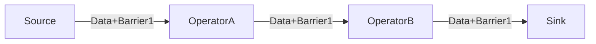

# Flink 端到端 Exactly-once 实现揭秘：从快照机制到两阶段提交

> **摘要**: 在金融支付、实时审计等业务场景中，数据“不丢不重”是核心红线。Flink 凭借其独特的检查点机制和两阶段提交协议，实现了在大规模分布式环境下的端到端精确一次语义。本文将带你深度剖析其背后的实现逻辑。

---

## 1. 为什么“精确一次”这么难？

在分布式流处理系统中，故障是常态。当某个算子挂掉重启时，我们需要面对两个灾难性问题：
1.  **数据丢失**：一部分数据在处理中途由于崩溃而消失。
2.  **数据重复**：上游为了保证不丢而重发数据，导致同一个订单被计算了两遍。

Flink 的 **Exactly-once** 指的是：即便发生故障，每条数据对算子内部状态（State）的影响也**仅有一次**，最终输出的结果就像故障从未发生过一样。

---

## 2. 内部基石：分布式一致性快照 (Chandy-Lamport 算法)

Flink 的 Checkpoint 机制是基于 **Chandy-Lamport 算法** 演进而来的。

### 2.1 什么是 Chandy-Lamport 算法？
在分布式系统中，各个节点独立运行且没有全局时钟，要想给整个系统拍一张“在某一瞬间”的全局状态合影极其困难。
**Chandy-Lamport 算法的核心思想是：通过在数据流中插入特殊的“标记”（Marker），来切割时间。**
- **现实隐喻**：想象一条流水线，上面有红蓝两种珠子。检查员在线上放了一个木板（Marker/Barrier）。当工人看到木板之前，就把处理过的红珠子记录下来（快照）；当看到木板之后，不管后面是什么，都属于“下一个阶段”的任务了。

在 Flink 中，这个“木板”被称为 **Barrier (屏障)**。



### 2.2 屏障对齐 (Barrier Alignment)
当一个算子有多个输入流时，它会等待所有输入端相同序号的 Barrier 都到达，才会执行快照并向下游发送 Barrier。这就保证了快照时刻，所有上游数据都已处理完成且状态已保存。

---

## 3. 跨越边界：端到端 (End-To-End) 精确一次

仅仅算子内部状态一致是不够的。如果 Sink 算子已经写出了数据但随后发生崩溃，重启后由于 Offset 回退，数据会再次写出，造成下游重复。

实现端到端 Exactly-once 必须满足三个条件：
1.  **Source 可重放**：如 Kafka，允许根据 Offset 重新消费。
2.  **Flink 内部开启一致性检查点**：`EXACTLY_ONCE` 模式。
3.  **Sink 具有事务性或幂等性**。

---

## 4. 深度协议：两阶段提交 (2PC) 与源码映射

针对像 Kafka 这样支持事务的汇，Flink 通过实现 `TwoPhaseCommitSinkFunction` (或新的 Sink V2 接口) 来完成。整个过程与 Chandy-Lamport 触发的分布式 Checkpoint 深度结合。

我们来看 Flink 源码中核心的四个方法是如何映射两阶段提交的：

### 阶段一：预提交 (Pre-commit)
1.  **发起快照**：JobManager 下发 Barrier 开启 Checkpoint。
2.  **源码体现 `beginTransaction()`**：Sink 算子在开启时，首先调用此方法，在 Kafka 侧开启一个新事务。
3.  **源码体现 `preCommit()`**：当 Sink 接收到 Barrier 时，调用此方法。此时它将当前事务标记为“待提交”，并紧接着调用 `beginTransaction()` 为下一波数据开启全新的事务。
    > *注：此时之前写出的数据已在 Kafka 中，但带着 `Uncommitted` 标记，对消费者不可见。*

### 阶段二：正式提交 (Commit)
1.  **确认完成**：JobManager 确认所有算子的快照都已成功持久化。向所有算子广播 `notifyCheckpointComplete` 成功消息。
2.  **源码体现 `commit()`**：Sink 收到成功通知后，调用此方法，向 Kafka 提交刚才处于预提交状态的事务。此时数据在 Kafka 变为 `Committed`。

### 故障恢复阶段
1.  **源码体现 `recoverAndCommit()`**：如果系统在“预提交已完成，但在执行正式 `commit()` 之前”崩溃了。重启后，Flink 会从 State 中反序列化出上一次挂掉前记录的**事务 ID**，在此方法中**再次请求** Kafka 提交该事务，防止数据丢失！

---

## 5. 生产环境避坑指南 (Best Practices)

1.  **Kafka 事务超时**：务必保证 `transaction.timeout.ms`（Kafka 侧，默认15分钟）大于 Flink 的 Checkpoint 间隔加上由于网络导致的最大延迟。否则还没开始 commit，事务就被 Kafka 强制中断了。
2.  **隔离级别设置**：消费 Flink 产出的数据时，消费者代码必须设置 `isolation.level: read_committed`，否则会读到脏数据。
3.  **两阶段提交的代价**：数据可见性与其 Checkpoint 的间隔绑定。下游看见数据的延迟 等于你的 Checkpoint 周期间隔。

---

## 💡 关联源码实战

结合你项目中的 [`SinkKafka.java`](../../../Code/flink-demo/flink/src/main/java/com/study/sink/SinkKafka.java)：

```java
// 在你的当前代码中，使用的是 AT_LEAST_ONCE。如果要享受两阶段提交带来的精确一次：
KafkaSink<String> sink = KafkaSink.<String>builder()
    .setBootstrapServers("172.16.9.89:9092...")
    // ...
    // 将此处改为 EXACTLY_ONCE，Flink 底层会自动挂载两阶段提交逻辑
    .setDeliveryGuarantee(DeliveryGuarantee.EXACTLY_ONCE)
    // 开启 EXACTLY_ONCE 后，强烈建议设置 Transaction Id Prefix，防止不同作业串联事务
    .setTransactionalIdPrefix("noctilucent-kafka-sink-")
    .build();
```

---
*作者：Antigravity*
*发布时间：2026-04-10*
