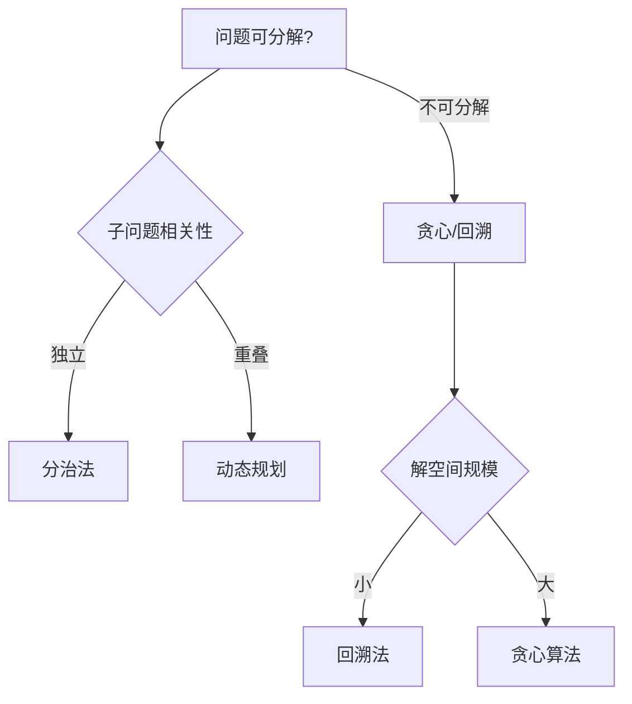
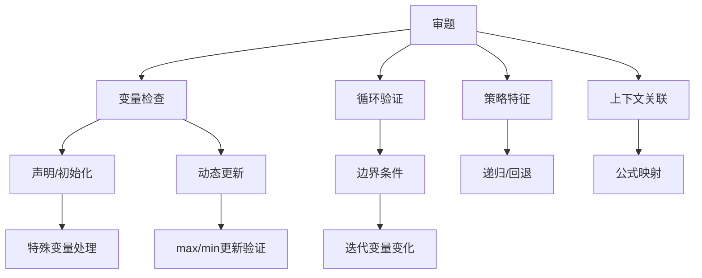

# 数据结构
## 队列
普通的队列是一种先进先出的数据结构，元素在队列尾追加，而从队列头删除。在优先队列中，元素被赋予优先级。当访问元素时，具有最高优先级的元素最先删除。优先队列具有最高级先出（largest—in，first—out）的行为特征。优先队列一般采用二叉堆数据结构实现，由于是二叉堆，所以插入和删除一个元素的时间复杂度均为O（lgn）。

### 循环队列


**优点：**
可以有效的利用资源。用数组实现队列时，如果不移动，随着数据的不断读写，会出现假满队列的情况。即尾数组已满但头数组还是空的;循环队列也是一种数组，只是它在逻辑上把数组的头和尾相连，形成循环队列，当数组尾满的时候，要判断数组头是否为空，不为空继续存放数据。

**缺点:**
循环队列中，由于入队时尾指针向前追赶头指针;出队时头指针向前追赶尾指针，造成队空和队满时头尾指针均相等。因此，无法通过条件front==rear来判别队列是"空"是"满"。

拓展知识:
为充分利用向量空间，克服"假溢出"现象的方法是:将向量空间想象为一个首尾相接的圆环，并称这种向量为循环向量。存储在其中的队列称为循环队列。

```java
/**
 * @author 
 * @version 1.0.0
 * @date 2020-05-13 18:56
 */
class MyCircularQueue {

    int[] elements;
    int front;
    int rear;

    /** Initialize your data structure here. Set the size of the queue to be k. */
    public MyCircularQueue(int k) {
        // initSize + 1 是因为需要一个位置空出来存放指针，所以实际存储的元素要比数组长度小1 
        elements = new int[k + 1];
    }

    /** Insert an element into the circular queue. Return true if the operation is successful. */
    public boolean enQueue(int value) {
        if (isFull()) {
            return false;
        }
        elements[rear] = value;
        rear = rear + 1 >= elements.length ? 0 : rear + 1;
        return true;
    }

    /** Delete an element from the circular queue. Return true if the operation is successful. */
    public boolean deQueue() {
        if (isEmpty()) {
            return false;
        }
        Object data = elements[front];
        // GC回收
        elements[front] = 0;
        front = front + 1 >= elements.length ? 0 : front + 1;
        return true;
    }

    /** Get the front item from the queue. */
    public int Front() {
        if (isEmpty()) {
            return -1;
        }
        return elements[front];
    }

    /** Get the last item from the queue. */
    public int Rear() {
        if (isEmpty()) {
            return -1;
        }
        if (rear == 0) {
            return elements[elements.length - 1];
        } else {
            return elements[rear - 1];
        }
    }

    /** Checks whether the circular queue is empty or not. */
    public boolean isEmpty() {
        return front == rear;
    }

    /** Checks whether the circular queue is full or not. */
    public boolean isFull() {
        return (rear + 1) % elements.length == front;
    }

    public static void main(String[] args) {
//        MyCircularQueue queue = new MyCircularQueue(2);
//        System.out.println(String.format("入队  %s", queue.enQueue(4)) + "  " + queue.front + "  " + queue.rear);
//        System.out.println(queue.Rear());
//        System.out.println(String.format("入队  %s", queue.enQueue(9)) + "  " + queue.front + "  " + queue.rear);
//        System.out.println(String.format("出队  %s", queue.deQueue()) + "  " + queue.front + "  " + queue.rear);
//        System.out.println(queue.Front());
//        System.out.println(String.format("出队  %s", queue.deQueue()) + "  " + queue.front + "  " + queue.rear);
//        System.out.println(String.format("出队  %s", queue.deQueue()) + "  " + queue.front + "  " + queue.rear);
//        System.out.println(queue.isEmpty());
//        System.out.println(String.format("出队  %s", queue.deQueue()) + "  " + queue.front + "  " + queue.rear);
//        System.out.println(String.format("入队  %s", queue.enQueue(6) + "  " + queue.front + "  " + queue.rear));
//        System.out.println(String.format("入队  %s", queue.enQueue(4) + "  " + queue.front + "  " + queue.rear));

        MyCircularQueue queue = new MyCircularQueue(3);
        System.out.println(String.format("入队  %s", queue.enQueue(1)) + "  " + queue.front + "  " + queue.rear);
        System.out.println(String.format("入队  %s", queue.enQueue(2)) + "  " + queue.front + "  " + queue.rear);
        System.out.println(String.format("入队  %s", queue.enQueue(3)) + "  " + queue.front + "  " + queue.rear);
        System.out.println(String.format("入队  %s", queue.enQueue(4)) + "  " + queue.front + "  " + queue.rear);
        System.out.println(queue.Rear());
        System.out.println(queue.isFull());
        System.out.println(String.format("出队  %s", queue.deQueue()) + "  " + queue.front + "  " + queue.rear);
        System.out.println(String.format("入队  %s", queue.enQueue(4) + "  " + queue.front + "  " + queue.rear));
        System.out.println(queue.Rear());

    }
}
```


# 树

树的特性：**边+1 = 结点**

#### 二叉树的重要特性

1、在二叉树的第i层上最多有2^i-1^个结点(i>=1);

2、深度为k的二叉树最多有2^k^-1个结点i(k>=1);

3、对任何一棵二叉树，如果其叶子结点数为n0，度为2的结点数为n2，则n0=n2+1。

4、具有n个结点的完全二叉树的深度为[log2n]+1。

5、如果对一棵有n个结点的完全二叉树的结点按层序编号(从第1层到 [log2n]+1 层，每层从左到右)，则对任一结点i(1<=i<=n)，有:

* 如果i=1，则结点i无父结点，是二叉树的根; 如果i>1，则父结点是[i/2];
* 如果2i>n，则结点i为叶子结点，无左子结点; 否则，其左子结点是结点2i;
* 如果2i+1>n，则结点i无右子叶点; 否则，其右子结点是结点2i+1。

# 图
图（Graph）是一种复杂的非线性表结构。
* 顶点（vertex）：图中的元素；
* 边（edge）：图中的顶点与其他任意顶点建立连接的关系；
* 顶点的度（degree）：跟顶点相连接的边的条数。
* 入度（In-degree）和出度（Out-degree）：对于有向图，一个顶点的入度是指以其为终点的边数；出度指以该顶点为起点的数；
* 图有多种类型，包括有向图、无向图、简单图、多重图等；

## 图的分类

1. 有向图（Directed Graph）与 无向图（Undirected Graph）
	图的每条边规定一个方向，那么得到的图称为有向图；相反，边没有方向的图称为无向图。
2. 简单图（Simple Graph）
	1.图中没有重复的边，即图中每条边只出现一次。2.每条边所关联的是两个不同的顶点
3. 带权图（Weighted Graph）
	在图中，每条边都带有一个权重值[非负实数]，用来表示边的重要程度。
4. 多重图（Multigraph）
	图中某两个顶点之间的边数多于一条，又允许顶点通过同一条边和自己关联，则称为多重图

## 图的存储
1. 邻接矩阵（Adjacency Matrix）

  

  用一个二维数组来表示，数组的行和列分别表示图的顶点，数组中的元素表示两个顶点之间是否存在边，存在边则值为1，不存在边则值为0。

  **优点：**

  1. 邻接矩阵的存储方式简单、直接，可以高效的获取两个顶点的关系；
  2. 计算方便。（求解最短路径 Floyd-Warshall 算法）

  **用邻接矩阵来表示一个图，虽然简单、直观，但是比较浪费存储空间。**

  1. 对于无向图，`a[i][j]` == `a[j][i]`，我们只需要存储一个就好，在二维数组中，通过对角线可以划分为两部分，我们只要利用其中一部分的空间就可以了，另外一部分则是多余的。

  2. 存储的是稀疏图（Sparse Matrix）：顶点很多，但每个顶点的边并不多，邻接矩阵的存储方法就更加浪费空间了。

     ```java
     public class AMWGraph {
         private ArrayList vertexList;//存储点的链表
         private int[][] edges;//邻接矩阵，用来存储边
         private int numOfEdges;//边的数目
         
         public AMWGraph(int n) {
             //初始化矩阵，一维数组，和边的数目
             edges=new int[n][n];
             vertexList=new ArrayList(n);
             numOfEdges=0;
         }
         
         //得到结点的个数
         public int getNumOfVertex() {
             return vertexList.size();
         }
         
         //得到边的数目
         public int getNumOfEdges() {
             return numOfEdges;
         }
         
         //返回结点i的数据
         public Object getValueByIndex(int i) {
             return vertexList.get(i);
         }
         
         //返回v1,v2的权值
         public int getWeight(int v1,int v2) {
             return edges[v1][v2];
         }
         
         //插入结点
         public void insertVertex(Object vertex) {
             vertexList.add(vertexList.size(),vertex);
         }
         
         //插入结点
         public void insertEdge(int v1,int v2,int weight) {
             edges[v1][v2]=weight;
             numOfEdges++;
         }
         
         //删除结点
         public void deleteEdge(int v1,int v2) {
             edges[v1][v2]=0;
             numOfEdges--;
         }
         
         //得到第一个邻接结点的下标
         public int getFirstNeighbor(int index) {
             for(int j=0;j<vertexList.size();j++) {
                 if (edges[index][j]>0) {
                     return j;
                 }
             }
             return -1;
         }
         
         //根据前一个邻接结点的下标来取得下一个邻接结点
         public int getNextNeighbor(int v1,int v2) {
             for (int j=v2+1;j<vertexList.size();j++) {
                 if (edges[v1][j]>0) {
                     return j;
                 }
             }
             return -1;
         }
     }
     ```

邻接表（Adjacency List）

  

  用一个数组来表示，数组中的元素表示图的顶点，数组中的元素是一个链表，链表中的元素表示顶点之间的边，链表中的元素为顶点在邻接矩阵中的下标。
  邻接表的优点是表示简单，缺点是空间复杂度较高，不能处理带权图。
  邻接表可以处理带权图，但是不能处理多重图。

  

## 图的遍历

### 深度优先搜索算法（DFS）

深度优先搜索（Depth-First-Search），类似于树的先序遍历，从图中某个顶点v出发，访问该顶点，然后依次从v的未被访问的邻接点出发继续深度优先遍历图中的其余顶点，直至图中所有与v有路径相通的顶点都被访问完为止。


**深度优先搜索的时间复杂度为 O(E)，E 表示边的个数；空间复杂度为 O(V)，V 表示顶点的个数。**

```java
//找到顶点后，终止递归的标志
boolean found = false; // 全局变量或者类成员变量
 
public void dfs(int s, int t) {
  found = false;
  //visited 记录已经被访问的顶点，避免顶点被重复访问
  boolean[] visited = new boolean[v];
  //prev 记录搜索路径
  int[] prev = new int[v];
  for (int i = 0; i < v; ++i) {
    prev[i] = -1;
  }
  recurDfs(s, t, visited, prev);
  print(prev, s, t);
}
 
private void recurDfs(int w, int t, boolean[] visited, int[] prev) {
  if (found == true) return;
  visited[w] = true;
  if (w == t) {
    found = true;
    return;
  }
  for (int i = 0; i < adj[w].size(); ++i) {
    int q = adj[w].get(i);
    if (!visited[q]) {
      prev[q] = w;
      recurDfs(q, t, visited, prev);
    }
  }
}
```

### 广度优先搜索算法（BFS）

广度优先搜索（Breadth-First-Search），一种“地毯式”层层推进的搜索策略，即先查找离起始顶点最近的，然后是次近的，依次往外搜索。


**广度优先搜索的时间复杂度为 O(E)，E 表示边的个数；空间复杂度为 O(V)，V 表示顶点的个数。**

```java
public void bfs(int s, int t) {
  if (s == t) return;
  //visited 记录已经被访问的顶点，避免顶点被重复访问
  boolean[] visited = new boolean[v];
  visited[s]=true;
  //queue 用来存储已经被访问、但相连的顶点还没有被访问的顶点
  Queue<Integer> queue = new LinkedList<>();
  queue.add(s);
  //prev 记录搜索路径
  int[] prev = new int[v];
  for (int i = 0; i < v; ++i) {
    prev[i] = -1;
  }
  while (queue.size() != 0) {
    int w = queue.poll();
   for (int i = 0; i < adj[w].size(); ++i) {
      int q = adj[w].get(i);
      if (!visited[q]) {
        prev[q] = w;
        if (q == t) {
          print(prev, s, t);
          return;
        }
        visited[q] = true;
        queue.add(q);
      }
    }
  }
}
 
private void print(int[] prev, int s, int t) { // 递归打印 1->9 的路径
  if (prev[t] != -1 && t != s) {
    print(prev, s, prev[t]);
  }
  System.out.print(t + " ");
}
```

---
// TODO 这部分需要优化

# 算法
算法（Algorithm）是在有限时间内解决特定问题的一组指令或操作步骤。
一个算法具有5个重要特性：有穷性、确定性、可行性、输入和输出。

1. 有穷性: 对于任意一组合法输入值，在执行**有穷步骤**之后**一定能结束**，即算法中的每个步骤都能在有限时间内完成。
2. 确定性：对于每种情况下所应执行的操作，在算法中都**有确切的规定**，使算法的执行者或阅读者都能明确其含义及如何执行，并且在任何条件下，算法都**只有一条执行路径**。
3. 可行性: 算法中的所有操作都必须足够**基本**，都可以通过己经实现的基本操作**运算有限次来实现**。


## 算法策略：贪心、分治、动态规划、回溯(试探)
* 贪心算法通过一系列的选择得到问题的解。它所做出的每一次选择是**当前状态下局部最优（一般用于求满意解）**选择，即贪心选择。典型应用:**背包问题(如装箱)、多机调度**、找零钱问题
* 分治法（Divide and Conquer）: 把大问题分解成一些较小的问题，然后由小问题的解方便地构造出大问题的解。
  * 典型应用: 斐波那契数列、**快速排序、归并排序**、矩阵乘法、**二分搜索**、大整数乘法、汉诺塔等。
  * 特点: 每个子问题通常只求解一次，且子问题之间相互独立。
* 动态规划（Dynamic Programming, DP）: 利用问题的**最优子结构**性质(保存每个子问题的解)，以**自底向上**的方式**递归**地从子问题的最优解逐步构造出整个问题的最优解。
  * 典型应用: 斐波那契数列、**矩阵乘法、(LCS)最长公共子序列、背包问题**、最短路径问题等。
  * 特点: 通过存储子问题的解来避免重复计算，通常使用自底向上的方式求解。
* 回溯法(试探法)是一种选优搜索法，按选优条件向前搜索，以达到目标。但当探索到某一步时，发现原先选择并不优或达不到目标，就退回一步重新选择，这种走不通就退回再走的技术为回溯法。回溯法求解的过程其实是搜索整个解空间，来找到最优的解。
  * 典型应用:  tsp(旅行商问题)、N皇后问题、迷宫、背包等。

> 迪杰斯特拉（Dijkstra）提出的按路径长度递增的次序产生最短路径的算法，其思想是把网中所有的顶点分成两个集合S和T、 S集合的初态只包含顶点v0，T集合的初态为网中除v0之外的所有顶点。凡以v0为源点，己经确定了最短路径的终点并入S集合中；顶点集合T则是尚未确定最短路径的顶点的集合。按各顶点与v0间最短路径长度递增的次序，逐个把T集合中的顶点加入到S集合中去，使得从v0到S集合中各顶点的路径长度始终不大于从v0到T集合中各顶点的路径长度。
	从迪杰斯特拉算法求最短路径的过程可知，其算法策略属于贪心策略。


# 算法应用与特征

## 算法应用案例
| 算法类型 | 典型应用场景 |
|---------|------------|
| 贪心算法 | 分数/部分背包问题、找零钱问题 |
| 动态规划 | 0-1背包问题、最长公共子序列(LCS)、旅行商问题(TSP) |
| 回溯法   | N皇后问题、迷宫求解、组合搜索 |

## 算法策略判断要点
1. **回溯法特征**
   - 包含探索与回退过程（典型特征：k=k-1操作）
   - 解空间树完整遍历
   - 常见于排列组合、约束满足问题

2. **分治法特征**
   - 二分思想为主（如快速排序/归并排序）
   - 时间复杂度：O(n log n)
   - 子问题相互独立，递归调用原函数
   - 特殊情况：大整数乘法(3次递归调用)

3. **动态规划特征**
   - 递归式+查表优化
   - 自底向上实现：O(nᵏ)（k=循环嵌套层数）
   - 自顶向下实现：O(2ⁿ)（如斐波那契递归）
   - 核心要素：
     - 最优子结构
     - 状态转移方程
     - 备忘录/DP表

4. **贪心算法特征**
   - 无递归式，仅局部最优选择
   - 可能获得近似解
   - 特殊情况：部分背包问题可得最优解
   - 判断条件：当前最优决策


## 策略选择决策树


## 时间复杂度梯度
$$
  O(1) → O(log n) → O(n^(2/3)) → O(1000n) → O(n log n) → O(n²) → O(n³) → O(2ⁿ) → O(n!)
$$

---
# 算法案例解题技巧
## 一、审题五步法
✅ **变量检查**
1. 变量声明与初始化
   - 检查所有变量是否声明，是否赋初值
   - 特殊变量初始化：`max=Integer.MIN_VALUE` / `min=Integer.MAX_VALUE`
   - **极值动态更新**：
     ```java
     if(x > max) max = x;  // 实时更新最大值
     if(x < min) min = x;  // 实时更新最小值
     ```
   - 示例：`int temp = 0;` 用于交换/中间存储

2. 返回值验证
   - 方法返回值是否符合题意（如`return result` vs `return -1`）
   - 注意集合类返回值（如`List<Integer>`的构造与返回）

✅ **循环边界检查**
3. for循环三要素
   ```java
   // 典型for结构
   for(初始化; 条件判断; 迭代操作) {
       // 边界易错点：i <= n vs i < n
   }
   ```

4. while循环控制
   - 初始条件设置
   - 终止条件验证（如链表遍历：`current != null`）
   - 避免死循环（需确保迭代变量变化）

✅ **算法策略特征验证**
5. 特殊算法操作标记
   | 算法类型 | 特征代码 | 示例 |
   |---------|---------|------|
   | 回溯法   | `k=k-1` 操作 | `path.remove(path.size()-1)` |
   | 分治法   | 递归调用自身 | mergeSort(arr, 0, mid) |
   | 动态规划 | 查表操作 | `dp[i] = dp[i-1] + nums[i]` |

## 二、代码上下文关联分析
🔍 **四维验证法**
1. **题干公式映射**
   - 数学公式 → 代码实现（如斐波那契：F(n)=F(n-1)+F(n-2)）
   - 边界条件 → 代码判断（如`n == 0`返回1）

2. **代码说明解析**
   - 变量定义说明：`// preSum[i]表示前i项和`
   - 特殊约定：`// 返回值范围[-1, 10^5]`

3. **上下文关联**
   - 方法签名参数验证（如`int[][] matrix`维度）
   - 调用栈关系（如递归深度限制）

4. **题干策略暗示**
   - 时间复杂度要求暗示算法（如`O(n)`→滑动窗口）
   - 特殊数据结构提示（如树结构→DFS/BFS）

## 三、典型错误模式对照表
| 错误类型 | 表现形式 | 修复方案 |
|---------|---------|---------|
| 变量未初始化 | `NullPointerException` | 添加初始赋值 |
| 循环边界错误 | 数组越界/漏处理最后一个元素 | 调试边界条件（i<=n vs i<n） |
| 递归无终止 | StackOverflowError | 检查base case |
| 状态未回退 | 回溯结果缺失 | 添加`k=k-1`操作 |
| 查表顺序错 | DP值计算错误 | 确保自底向上填充 |

## 四、解题思维导图


参考：https://xeh1430.github.io/text/dataStructure11.html
